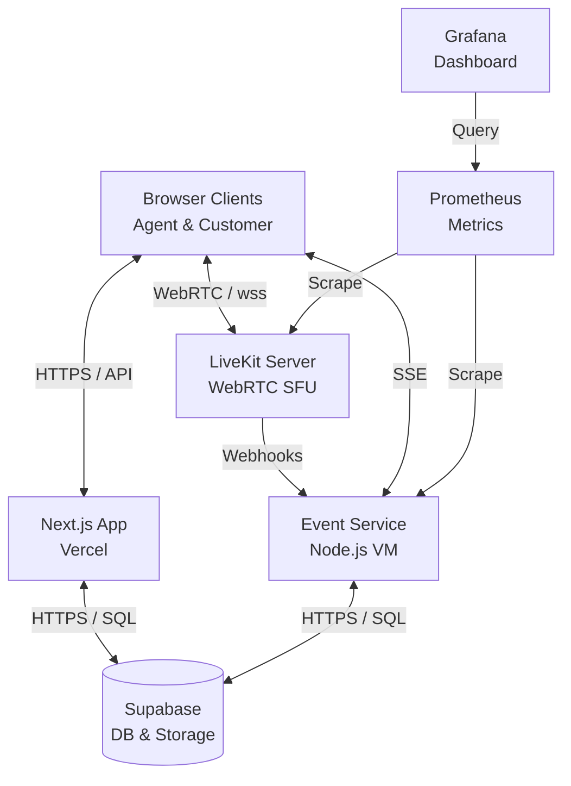

# AtomQuest Video Support

Real-time video support platform built for the AtomQuest Hackathon 1.0.

## Accounts (Login Credentials)

| Role    | Email                  | Password     |
| ------- | ---------------------- | ------------ |
| Agent   | agent@atomquest.dev    | Agent@2026!  |
| Admin   | admin@atomquest.dev    | Admin@2026!  |

## Architecture

- **Frontend**: Next.js 16 (App Router) + Tailwind CSS, deployed on Vercel
- **Media**: LiveKit Cloud (WebRTC video/audio/data channels)
- **Database**: Supabase (Postgres + Auth + Storage)
- **VM Services**: Node/Express event-service on Oracle VM (webhooks, SSE, metrics)
- **Observability**: Prometheus + Grafana

### System Design Diagram



## Getting Started

```bash
cd frontend
npm install
cp .env.example .env.local  # fill in credentials
npm run dev
```

## File Upload

The `shared_files` Supabase storage bucket is configured with server-side enforcement:

- **Size limit**: 5,242,880 bytes (5 MB) — the bucket rejects any file over 5 MB with a 413 response, server-side.
- **MIME whitelist**: `image/jpeg`, `image/png`, `application/pdf` — the bucket rejects any file outside the allowed types with a 413 response, server-side.
- **S3 keys**: Always server-generated. The client's original filename is never used as the storage key.
- **Downloads**: Each download request mints a fresh, short-lived (60s) signed URL from the stored `s3_key`. Long-lived URLs are never stored or cached.

### Setup

Run the SQL in [`supabase/storage-buckets.sql`](supabase/storage-buckets.sql) in the Supabase SQL Editor to create and configure the storage buckets.

## Recordings

- **Start/Stop**: Agent-only via `/api/recordings/start` and `/api/recordings/stop`.
- **Egress**: Room composite with track composite fallback.
- **Status machine**: `in_progress → processing → ready` (or `failed`), driven by LiveKit webhook events on the VM event-service.
- **Downloads**: `/api/recordings/[id]/download` mints a fresh signed URL from the stored `s3_key` on every request. The key is stored; the URL is never persisted.

## VM Event Service Deployment

```bash
cd vm-services/event-service
cp .env.example .env  # fill in credentials
cd ../infrastructure
docker compose up --build -d
```

Then configure your LiveKit project webhook URL to point to `https://events.<domain>/webhooks/livekit`.

## Known Limitations & Design Decisions

1. **LiveKit Cloud vs Self-Hosting**: 
   - **Defense**: LiveKit is an open-source SFU. A fully functional self-hosted deployment is included directly in the repository (`vm-services/infrastructure/` containing the LiveKit server, Caddy, and configurations). 
   - We utilized LiveKit Cloud strictly for demo-day reliability, network consistency, and high availability. To transition entirely to self-hosting, one simply provisions a VM with the included docker-compose setup and updates the `LIVEKIT_URL` variable.
2. **Cold Starts**: The VM Event Service is currently deployed on Render's free tier for this hackathon. If idle for >15 minutes, it will spin down, requiring a 30-60s cold start. LiveKit webhooks fired during this window may be delayed or dropped, meaning the Admin/Agent panel's Live View might briefly lag until the service warms up.
3. **Database Polling**: The frontend currently relies heavily on polling (e.g., `setInterval` for fetching events) instead of pure WebSockets. This was a design tradeoff to ensure rapid iteration, but a production grade app would stream these updates via SSE or WebSockets directly from the event service.

---
*Deployed on Vercel & Render for Hackathon Finale*
