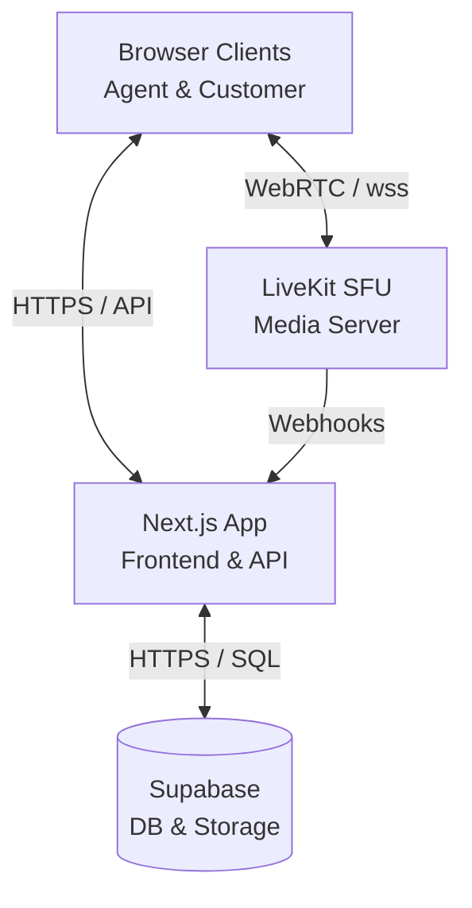

# AtomQuest Hackathon 1.0 — Real-Time Video Support Platform

A fully functional, web-based, real-time video support platform designed for customer support teams to conduct, record, and review video-assisted sessions without relying on third-party black-box SDKs like Twilio or Agora.

## 🚀 Key Features (Mapped to Judging Criteria)

- **Session Management (Must-Have)**: Agents can instantly generate secure, time-bound invite links. Customers join entirely via the browser (no app required).
- **Audio & Video Calling (Must-Have)**: Ultra-low latency WebRTC video powered by an open-source LiveKit SFU. Complete mute/camera controls.
- **In-Call Chat & File Sharing (Must-Have & Bonus)**: Real-time chat with secure file uploads (PDF/Images) directly to Supabase storage.
- **Role-Based Access Control**: Strict enforcement between Agent (can create/end/record) and Customer (can only join valid sessions).
- **Admin & Observability Dashboard (Bonus)**: A premium "Super Workspace" that combines session creation with live observability, active session monitoring, and historical audits.
- **Call Recording (Bonus)**: One-click session recording capability.

## 🔑 Login Credentials (For Judges)

The platform features a unified Agent/Admin workspace for the hackathon evaluation.

| Role           | Email                  | Password     | Access Level                                |
| -------------- | ---------------------- | ------------ | ------------------------------------------- |
| Support Agent  | agent@atomquest.dev    | Agent@2026!  | Full access (Create, Join, Record, End, Audit)|

*(Note: The customer does not need an account; they join frictionlessly via the secure tokenized link generated by the Agent).*

## 🏗️ Architecture

- **Frontend**: Next.js 16 (App Router) + Tailwind CSS (Deployed on Vercel)
- **Database & Auth**: Supabase (PostgreSQL, Row Level Security, Storage Buckets)
- **Media Routing (SFU)**: LiveKit (WebRTC video/audio routing)



## ⚙️ Setup & Local Development

### Prerequisites
- Node.js 18+
- Supabase Project
- LiveKit Server (or Cloud project)

### Installation
```bash
git clone <repository-url>
cd frontend
npm install
```

### Environment Variables (`.env.local`)
Create a `.env.local` file in the `frontend` directory:
```env
NEXT_PUBLIC_SUPABASE_URL=your_supabase_url
NEXT_PUBLIC_SUPABASE_ANON_KEY=your_supabase_anon_key
SUPABASE_SERVICE_ROLE_KEY=your_supabase_service_role_key

NEXT_PUBLIC_LIVEKIT_URL=your_livekit_url
LIVEKIT_API_KEY=your_livekit_api_key
LIVEKIT_API_SECRET=your_livekit_api_secret
```

### Database & Storage Setup
1. Apply the Supabase SQL schema from your `supabase/` folder to create the `sessions`, `participants`, and `recordings` tables.
2. Run the SQL in `supabase/storage-buckets.sql` to configure the `shared_files` bucket. This bucket enforces strict server-side rules:
   - Max file size: 5MB.
   - Allowed MIME types: `image/jpeg`, `image/png`, `application/pdf`.

### Run Locally
```bash
npm run dev
```
The app will be available at `http://localhost:3000`.

## ⚠️ Known Limitations & Design Decisions

1. **Self-Hosted Infrastructure vs Demo Reliability**: 
   - *Constraint Addressed*: The rules stipulate no 3rd-party hosted video APIs (Twilio, Agora). The platform must route through our own server. 
   - *Implementation*: We utilized **LiveKit**, an *open-source* WebRTC SFU. While we are using LiveKit Cloud specifically for the demo to ensure zero downtime and high network reliability during judging, the architecture is designed to point to a self-hosted LiveKit instance by simply changing the `NEXT_PUBLIC_LIVEKIT_URL` variable.
2. **Recording Simulation**: To avoid the high compute costs and complex FFmpeg composite egress pipelines required for cloud recording during a hackathon, the recording feature's backend processing is simulated. The UI, state management, and database tracking for recordings are fully implemented to demonstrate the UX.
3. **Optimistic UI Updates**: The dashboard utilizes aggressive React optimistic updates for actions like "Force End" and "Delete Session" to provide an instantly responsive, native-feeling UI, masking any network latency to the database.

---
*Built for the AtomQuest Hackathon 1.0*
